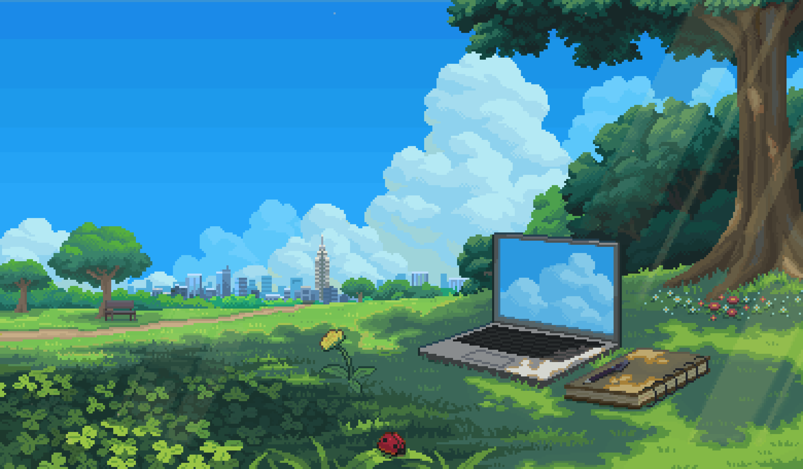

<!-- HEADER BANNER -->

  

<!-- STATUS BADGES -->

  
  
  

 

---

### About Me

Information System student at **UPN "Veteran" Yogyakarta** focusing on frontend architecture, web application development, and system integration. Dedicated to building reliable, high-performance web software through structured engineering practices, modular component design, and responsive user interfaces.

- **Institution:** UPN "Veteran" Yogyakarta
- **Domain Focus:** Software Engineering, Web Systems, UI/UX Architecture
- **Active Initiatives:** Developing production-grade web applications and exploring browser-native multimedia processing

---

### GitHub Trophies

  

---

### Featured Projects

#### 001 // KlipKlap

  

Web-based photobooth and studio image editor application.

  
  
  
  
  

- Live camera streaming via HTML5 MediaDevices / webcam hook integration.
- Dynamic canvas composition engine for custom frames, filters, and photo strips.
- State-driven studio controls including photo reordering and slot calibration.

[Source Code](https://github.com/r16-code/KlipKlap) | [Live Demo](https://klipklap-studio.vercel.app)

---

### Technical Arsenal

#### Frontend & UI Engineering

  
  
  
  
  
  
  

#### Backend & Core Languages

  
  
  

#### Tooling & Environment

  
  
  
  

---

### GitHub Activity & Analytics

  
  

  

  

 

  

---

### Connect

  
  
  

<!-- FOOTER BANNER -->

  

