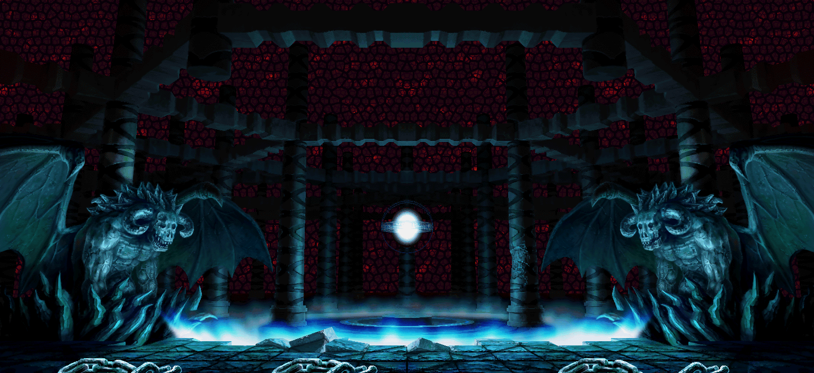
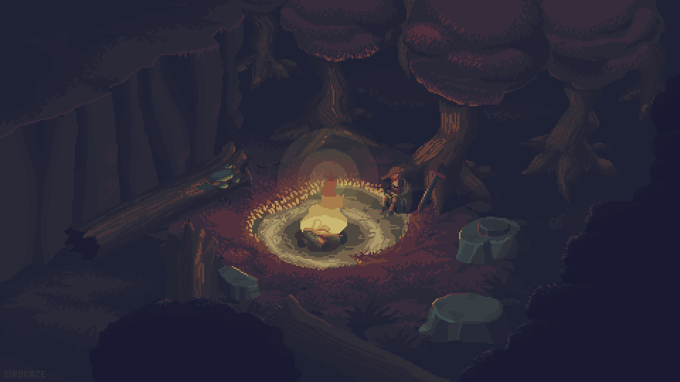
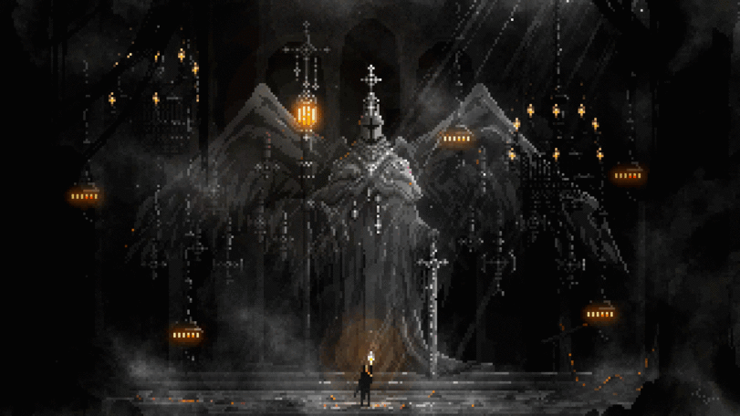

<!-- DUNGEON GATE / HERO CITADEL -->

  

<!-- SPLIT-HUD: CHARACTER STATUS & CLEARED RAID -->
<table width="100%">
  <tr>
    <td width="50%" valign="top">
      <h3 align="center">CHARACTER SHEET // STATUS HUD</h3>
      

        <b>CLASS:</b> Interface Architect & Software Weaver 
        <b>GUILD:</b> UPN "Veteran" Yogyakarta 
        <b>SPECIALTY:</b> Web Architecture & Real-Time Media Engines 
        <b>ALIGNMENT:</b> High-Leverage Software Engineering
      

      

      <h4 align="center">ATTRIBUTE GAUGES</h4>
      <pre>
INT [Architecture]  [██████████████████░░] LVL 88
DEX [Canvas Engine] [████████████████████] MAX
STR [Core Systems]  [████████████████░░░░] LVL 80
STA [Code Quality]  [██████████████████░░] LVL 90
      </pre>
      

        Information System student focusing on frontend architecture, web applications, and intelligent systems. Dedicated to building reliable, high-performance web software through structured engineering practices.
      

    </td>
    <td width="50%" valign="top">
      <h3 align="center">CLEARED RAID // ARTIFACT_001</h3>
      

        <b>TARGET:</b> KlipKlap 
        <b>RANK:</b> S-Rank Multimedia Engine
      

      

        
      

      

        Web-based photobooth and studio image editor application.
      

      <ul>
        <li>Live camera streaming via HTML5 MediaDevices integration.</li>
        <li>Dynamic canvas composition engine for custom frames & filters.</li>
        <li>State-driven studio controls for slot calibration.</li>
      </ul>
      

        
        
      

    </td>
  </tr>
</table>

<!-- RELIC VAULT -->
<h3 align="center">RELIC VAULT // SYSTEM TROPHIES</h3>

  <code>LOCATION: ANCIENT RELIQUARY // CLEARANCE: UNLOCKED</code>

  

<!-- EQUIPMENT LOADOUT -->
<h3 align="center">EQUIPMENT LOADOUT // TECHNICAL ARMORY</h3>

  <code>INVENTORY MATRIX: ACTIVE GEAR LOADOUT & COMBAT TOOLS</code>

<table width="100%">
  <tr>
    <td width="25%" align="center" valign="top">
      <h4>MAIN HAND</h4>
      <code>Client Core</code>
        
        
        
        
      
    </td>
    <td width="25%" align="center" valign="top">
      <h4>ARMOR & WARDS</h4>
      <code>Styling & Visual</code>
        
        
        
        
      
    </td>
    <td width="25%" align="center" valign="top">
      <h4>SPELLBOOKS</h4>
      <code>Languages & Logic</code>
        
        
        
        
      
    </td>
    <td width="25%" align="center" valign="top">
      <h4>UTILITIES</h4>
      <code>Forge & Tooling</code>
        
        
        
        
      
    </td>
  </tr>
</table>

 

<!-- BONFIRE REST / CHECKPOINT -->

  

<!-- TELEMETRY & COMBAT CHRONICLE -->
<h3 align="center">DUNGEON TELEMETRY // COMBAT CHRONICLE</h3>

  <code>LOG ENTRY: ACTIVE DUNGEON SENSORS // CYCLE: REAL-TIME</code>

  
  

  

  

<!-- GUILD DISPATCH / CONNECT -->
<h3 align="center">GUILD DISPATCH // SUMMONING CIRCLE</h3>

  <code>COMM CHANNEL: ENCRYPTED GUILD CARRIER // TRANSMISSION: READY</code>

  
  
  

 

<!-- DUNGEON SEAL / VAULT TERMINATION -->

  

